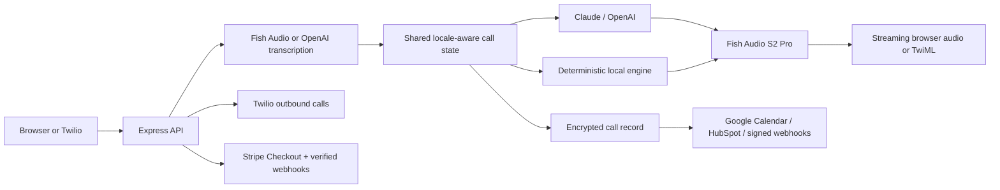

# VoiceOps Studio — Multilingual Voice Operations Console

VoiceOps Studio is a productized, white-label voice-agent MVP for service businesses. It captures a customer request, extracts structured intent and missing details, speaks a response, meters active voice usage, enforces monthly cost limits, and can persist a separately consented call record across ten languages.

**[Open the live demo](https://voiceops-studio-production.up.railway.app/#/present)** · [Read the case study](docs/CASE_STUDY.md)


## What it demonstrates

- Ten shared locales across the browser, transcription, decision logic, speech synthesis, Twilio, and persisted records: English, Turkish, Spanish, German, French, Italian, Portuguese, Dutch, Polish, and Russian.
- Live Fish Audio speech synthesis with browser speech fallback when a provider is unavailable.
- Optional Claude or OpenAI response generation plus a deterministic local decision engine for appointment, pricing, and support flows.
- Streaming NDJSON responses, MediaSource audio playback, silence detection, request cancellation, and barge-in support.
- Consent enforcement, optional AES-256-GCM record encryption, retention controls, admin authorization, and privacy-safe request logging.
- Environment-driven customer branding, plan configuration, active-voice metering, monthly hard limits, and a protected operations dashboard.
- Locale-aware Twilio voice webhooks with signature verification and `<Play>`/`<Say>` fallback behavior.
- Protected outbound Twilio calls, Google Calendar event creation, HubSpot contact upsert, and Stripe subscription Checkout/webhook flows.
- A responsive presentation console with light/dark themes and explicit live/degraded service state.

## Verified evidence

| Claim | Current evidence | State |
| --- | --- | --- |
| Ten-language intent flow | Shared locale contract plus automated appointment extraction tests for all ten locales | Verified |
| Fish Audio TTS | Real MP3 response reproduced locally with Fish Audio S2 Pro | Verified |
| First audio | 1.46 s observed in one Railway production smoke run on 2026-08-14; environment-dependent, not a benchmark | Observed |
| Automated validation | `npm test` → 64 passing tests | Verified |
| Production bundle | `npm run check` and `npm run build` pass on Node 22 | Verified |
| HTTP/telephony workflow | Production smoke test covers health, consent, records, admin auth, Twilio signature, TwiML, and phone turns (14 checks) | Verified |
| Responsive UI | Browser-reviewed at 1440 px and 390 px without horizontal overflow | Verified |

The verification date and release boundary are recorded in [`projects/voiceops-studio/docs/delivery/system-state.yaml`](projects/voiceops-studio/docs/delivery/system-state.yaml).

## Architecture



Important implementation paths:

- [`shared/i18n.ts`](shared/i18n.ts) — locale contract and metadata
- [`shared/call-logic.ts`](shared/call-logic.ts) — deterministic intent and slot extraction
- [`server/routes.ts`](server/routes.ts) — browser API, streaming, provider health, and fail-soft behavior
- [`server/telephony.ts`](server/telephony.ts) — signed Twilio voice workflow
- [`server/records.ts`](server/records.ts) — retention, encrypted records, and integrations
- [`server/integrations.ts`](server/integrations.ts) — Twilio, Google Calendar, HubSpot, Stripe, and generic webhook adapters
- [`server/usage.ts`](server/usage.ts) — server-side active-voice metering, summaries, and monthly quota enforcement
- [`server/web-sessions.ts`](server/web-sessions.ts) — server-authoritative turns with optional encrypted restart persistence
- [`server/product.ts`](server/product.ts) — safe public white-label configuration and paid-customer readiness gate
- [`client/src/App.tsx`](client/src/App.tsx) — recording, interruption, streaming playback, and operator UI

## Engineering decisions

### One locale contract, end to end

The locale is not treated as presentation-only state. A shared contract carries it through UI copy, speech recognition, prompts, deterministic extraction, voice selection, Twilio, summaries, and records. This reduces cross-layer language drift.

### Fail soft without pretending everything is live

Provider health is based on runtime results, not only the presence of an environment variable. If live intelligence fails while Fish remains available, the interface reports `FISH LIVE`, uses the local decision engine, and keeps real speech output active.

### Store the minimum useful record

Raw audio is not persisted. Completed requests can store a bounded transcript and structured call state, optionally encrypted at rest. Logs contain request metadata rather than customer speech or contact details.

## Run locally

Requirements: Node.js 22+ and npm.

```bash
npm ci
cp .env.example .env
npm run dev
```

Open `http://localhost:5177/#/present`. The interface and deterministic scenarios work without external credentials.

The protected operations view is available at `http://localhost:5177/#/admin`; enter `ADMIN_API_KEY` in the in-memory login form to view monthly usage and consented lead records.

The same view reports provider readiness, starts protected outbound test calls, and creates Stripe subscription Checkout sessions. See [`docs/INTEGRATIONS.md`](docs/INTEGRATIONS.md) for provider setup and webhook URLs.


To enable live speech, add `FISH_AUDIO_API_KEY` to `.env`. To enable open-ended model responses, also add either `ANTHROPIC_API_KEY` or `OPENAI_API_KEY`. Secret values stay server-side and `.env` is gitignored.

## Validate

```bash
npm run check
npm test
npm run build
```

The bounded load smoke refuses provider-backed targets by default so an accidental run cannot create model or speech charges. Against an isolated demo-mode server, run:

```bash
LOAD_BASE_URL=http://127.0.0.1:5193 npm run smoke:load
```

For the production HTTP/Twilio smoke flow, start the production bundle with isolated test environment values, then run:

```bash
SMOKE_BASE_URL=http://127.0.0.1:5193 npm run smoke:http
```

CI runs `npm ci`, type checking, all tests, and the production build on every push and pull request.

## Deploy on Railway

The repository includes [`railway.json`](railway.json) and a multi-stage [`Dockerfile`](Dockerfile). Railway uses the Docker image, waits for `/api/health/ready`, and restarts the service after process failures.

1. Create a Railway service from this GitHub repository.
2. Add provider and security values from `.env.example` in Railway Variables; do not upload the local `.env` file.
3. Generate a temporary `*.up.railway.app` domain under **Settings → Networking**.
4. For call records that survive deployments, attach a Railway volume at `/app/data` and set `DATA_DIR=/app/data`.
5. Run a prepared appointment scenario and verify `/api/status` before sharing the URL.

For a paid customer deployment, set `CUSTOMER_MODE=true`, `APP_REVISION` to the reviewed 40-character commit SHA, `WEB_REPLICA_COUNT=1`, `WEB_SESSION_STORAGE=encrypted-file`, and complete every customer/product variable in `.env.example`. Production startup and readiness fail closed if branding, revision provenance, privacy contact, 32+ character encryption/admin credentials, encrypted restart-persistent web sessions, provider intelligence, allowed origins, or a positive monthly usage limit is missing. Configured Anthropic/OpenAI credentials are checked against the providers' model-list endpoints and Fish Audio is checked for authenticated usable credit before the server starts listening; invalid, unauthorized, unfunded, timed-out, or unreachable credentials keep readiness closed without logging the key or balance. `PROVIDER_PREFLIGHT_TIMEOUT_MS` controls each bounded check (default 5000 ms). The encrypted file backend is durable on the attached volume but not shared; add a networked session store before increasing the replica count. Before traffic, run the evidence-backed [`launch:gate`](docs/CUSTOMER_ONBOARDING.md#executable-launch-evidence) command against the dedicated customer environment.

Railway provides the runtime `PORT`; the server already binds it on `0.0.0.0`.

## Operational safeguards implemented

- Security headers, same-origin checks, request size limits, and IP-based rate limiting
- Health and readiness endpoints
- Structured request logs with correlation IDs and without conversation content
- Optional encrypted JSONL records, admin list/delete endpoints, and retention pruning
- Server-side active-voice metering, protected monthly reports, and configurable hard quota enforcement
- Twilio request signature verification in production
- Docker multi-stage build that fixes the dedicated volume mount, then runs the application process as the non-root `node` user
- Provider timeouts, cancellation propagation, and local fallback paths

See [`PRIVACY.md`](PRIVACY.md) for the data-flow and retention notes, [`SECURITY.md`](SECURITY.md) for private vulnerability reporting, [`docs/CUSTOMER_ONBOARDING.md`](docs/CUSTOMER_ONBOARDING.md) for the paid-customer launch gate, [`docs/BACKUP_RESTORE.md`](docs/BACKUP_RESTORE.md) for encrypted recovery, and [`docs/RUNBOOK.md`](docs/RUNBOOK.md) for runtime modes, incidents, and rollback boundaries.

## Current status and limits

VoiceOps Studio has a public portfolio deployment and can be configured as a managed single-customer MVP. It is not a self-service multi-tenant SaaS or a production-readiness certification. Production use still requires organization-specific legal review, provider/data-processing review, secret rotation, external monitoring, load testing, backup/restore validation, and an incident process. The observed latency above is a single smoke run and does not claim an SLA.

The proposed commercial package, cost assumptions, billing basis, and scope boundary are documented in [`docs/COMMERCIAL_OFFER.md`](docs/COMMERCIAL_OFFER.md). The prepared portfolio walkthrough includes a [ready-to-upload LinkedIn MP4](docs/demo/voiceops-linkedin-demo.mp4) and its reproducible [`docs/DEMO_SCRIPT.md`](docs/DEMO_SCRIPT.md) storyboard.

Fish Audio, Anthropic, OpenAI, and Twilio are third-party services. This repository is not affiliated with or endorsed by those providers.

Released under the [MIT License](LICENSE).

Additional portfolio notes and the publication gate are in [`docs/CASE_STUDY.md`](docs/CASE_STUDY.md).
